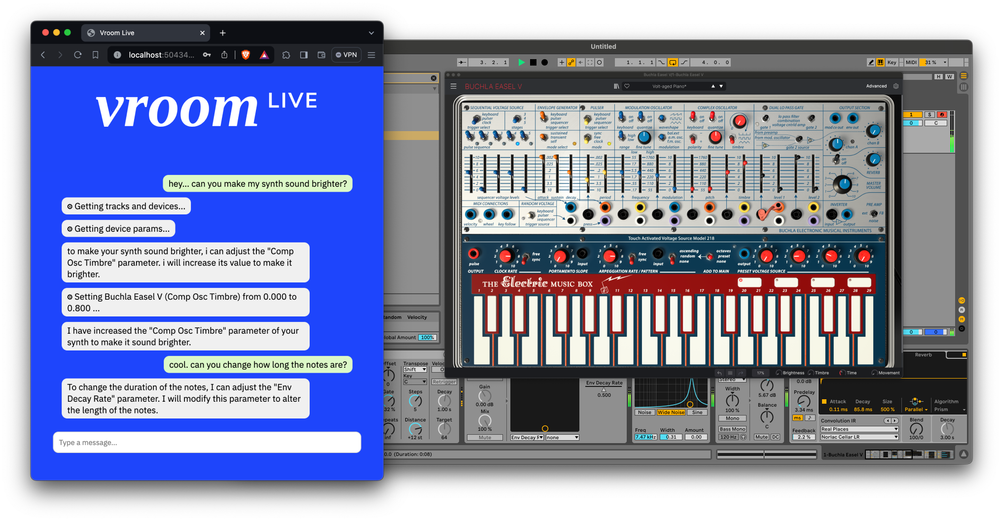

<h1 align="center"> Vroom Live </h1>

<h3 align="center">
	🎉 Awarded "Best Presentation" at Timbre Tools Hackathon 2024 🎉 <br>
</h3>

<br>
<p align="center">
  
</p>

## Summary

Vroom Live allows you to chat directly with your Ableton Live session. It has the ability to view your tracks, instruments and devices and modulate parameters. It works by creating an agent using GPT3.5 and tools that can communicate via OSC over WebSocket.

This repository was created as a submission to the [Timbre Tools Hackathon 2024](https://comma.eecs.qmul.ac.uk/timbre-tools-hackathon/).

## Installation

1. Install [AbletonOSC](https://github.com/vroomai/AbletonOSC) by Daniel Jones.

```
mkdir -p "$HOME/Music/Ableton/User Library/Remote Scripts/AbletonOSC" && \
wget -qO- https://github.com/vroomai/AbletonOSC/archive/refs/heads/master.zip | \
bsdtar --strip-components 1 -C "$HOME/Music/Ableton/User Library/Remote Scripts/AbletonOSC" -xf -
```

## Usage

1. Start Ableton, in `Preferences > Link / Tempo / MIDI`, under the Control Surface dropdown, select the new "AbletonOSC" option.

2. Navigate to [https://live.vroomai.com](https://live.vroomai.com) and enter your OpenAI key.

## Discord

If you want to ask any questions or follow updates - [join the discord](https://discord.gg/Ua8sqvjher)!

## Authors

[Monty Anderson](https://montyanderson.net) ([Prodia Labs](https://prodia.com))

[Barney Hill](https://www.barneyhill.com) (University of Oxford)
